<div align="center">

# 🩺 SebaSathi AI

### AI-Powered Healthcare Assistance and Doctor Appointment Platform

**SebaSathi AI** is a full-stack healthcare web application that helps patients find doctors, request appointments, review medical professionals, manage healthcare activity, and receive AI-assisted general health guidance in Bangla, Banglish, or English.

The platform combines public healthcare discovery, role-based dashboards, appointment management, doctor administration, persistent AI conversations, and structured health-history summaries in one responsive system.

<br />

[](https://sebasathiai-frontend.vercel.app)
[](https://github.com/kouser-ahamed/sebasathiai-frontend)
[](https://github.com/kouser-ahamed/sebasathiai-backend)

</div>

---

## 📋 Table of Contents

- [Project Overview](#-project-overview)
- [Purpose of the Project](#-purpose-of-the-project)
- [Live Links](#-live-links)
- [Demo User Credentials](#-demo-user-credentials)
- [Key Features](#-key-features)
- [How SebaSathi AI Works](#-how-sebasathi-ai-works)
- [Role-Based Workflows](#-role-based-workflows)
- [AI Health Assistant Workflow](#-ai-health-assistant-workflow)
- [Authentication and Authorization](#-authentication-and-authorization)
- [Technology Stack](#-technology-stack)
- [Package Commands](#-package-commands)
- [NPM Packages](#-npm-packages)
- [Database Collections](#-database-collections)
- [Environment Variables](#-environment-variables)
- [Installation and Setup](#-installation-and-setup)
- [Project Routes](#-project-routes)
- [API Overview](#-api-overview)
- [Project Structure](#-project-structure)
- [Architecture Notes](#-architecture-notes)
- [Security Notice](#-security-notice)
- [Screenshots](#-screenshots)
- [Developer](#-developer)
- [Project Information](#-project-information)

---

## 📌 Project Overview

SebaSathi AI is a healthcare-focused full-stack platform designed to make doctor discovery, appointment requests, health-history management, and general AI-assisted guidance easier for patients.

Public users can explore available doctors and open detailed doctor profiles. Authenticated patients can request appointments, view appointment information, interact with the AI Health Assistant, and save structured health summaries. Doctors can access role-specific dashboard features, while administrators can manage users, create doctor accounts, and control account status.

The AI Health Assistant supports Bangla, Banglish, and English. It can maintain conversation memory, stream responses, suggest suitable doctor categories, provide general next-step guidance, and generate structured health-history summaries linked to saved conversations.

The application uses **Next.js 16**, **React**, **TypeScript**, **Tailwind CSS 4**, **HeroUI**, **Better Auth**, **Express 5**, **MongoDB**, **JOSE-based JWT verification**, and the **Groq API**.

---

## 📸 Screenshots

The screenshots below are stored in:

```text
public/assets/SebaSathiAI/UI/
```

<table>
  <tr>
    <td align="center"><strong>SebaSathi AI Screenshot 01</strong></td>
    <td align="center"><strong>SebaSathi AI Screenshot 02</strong></td>
  </tr>
  <tr>
    <td>
      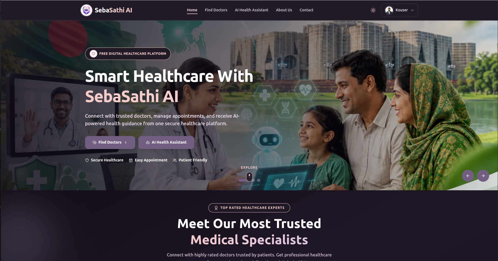
    </td>
    <td>
      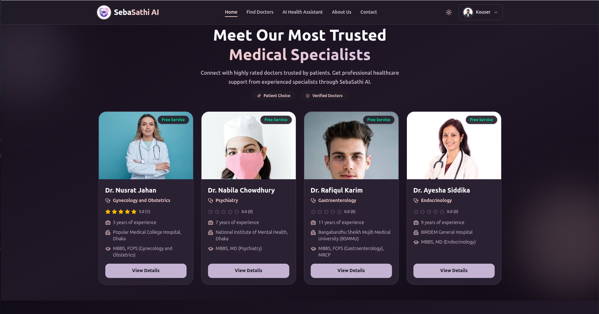
    </td>
  </tr>

  <tr>
    <td align="center"><strong>SebaSathi AI Screenshot 03</strong></td>
    <td align="center"><strong>SebaSathi AI Screenshot 04</strong></td>
  </tr>
  <tr>
    <td>
      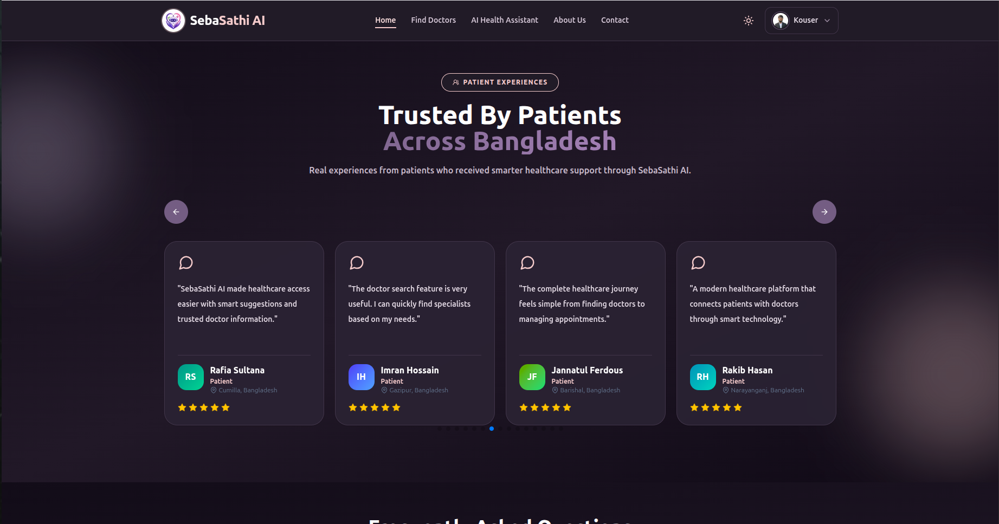
    </td>
    <td>
      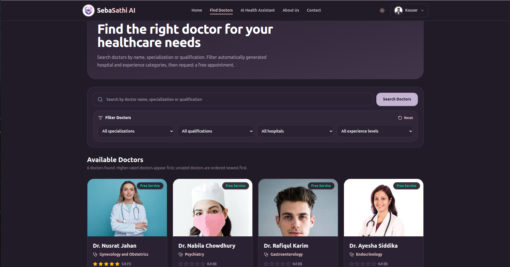
    </td>
  </tr>

  <tr>
    <td align="center"><strong>SebaSathi AI Screenshot 05</strong></td>
    <td align="center"><strong>SebaSathi AI Screenshot 06</strong></td>
  </tr>
  <tr>
    <td>
      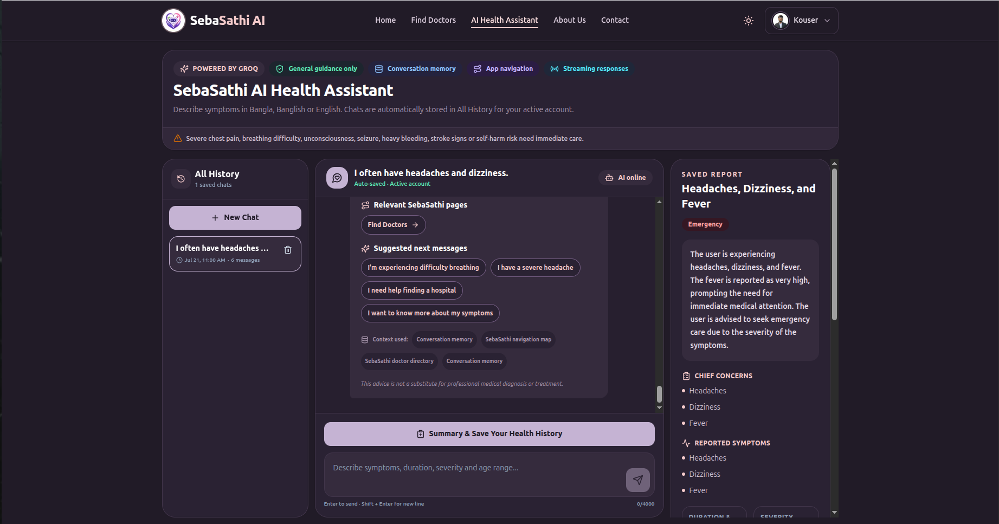
    </td>
    <td>
      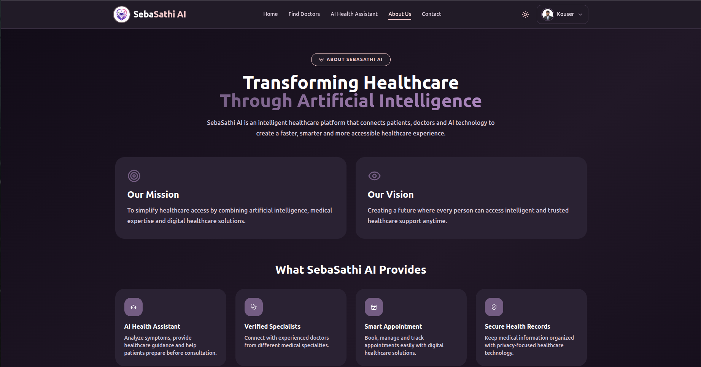
    </td>
  </tr>

  <tr>
    <td align="center"><strong>SebaSathi AI Screenshot 07</strong></td>
    <td align="center"><strong>SebaSathi AI Screenshot 08</strong></td>
  </tr>
  <tr>
    <td>
      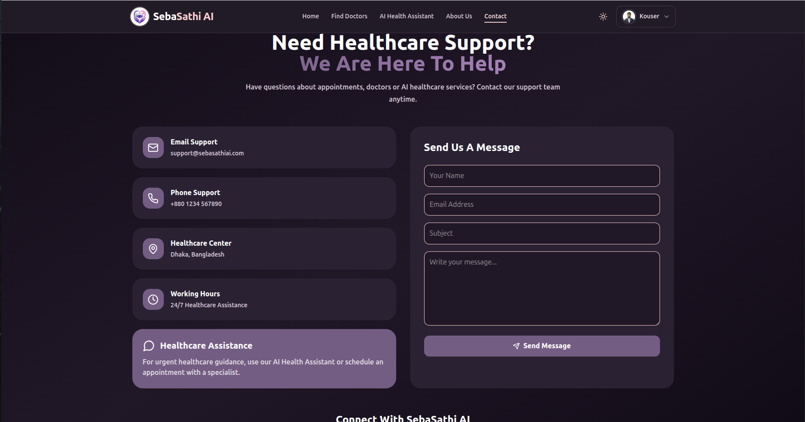
    </td>
    <td>
      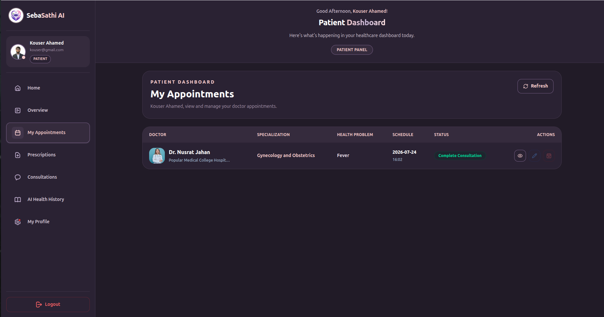
    </td>
  </tr>

  <tr>
    <td align="center"><strong>SebaSathi AI Screenshot 09</strong></td>
    <td align="center"><strong>SebaSathi AI Screenshot 10</strong></td>
  </tr>
  <tr>
    <td>
      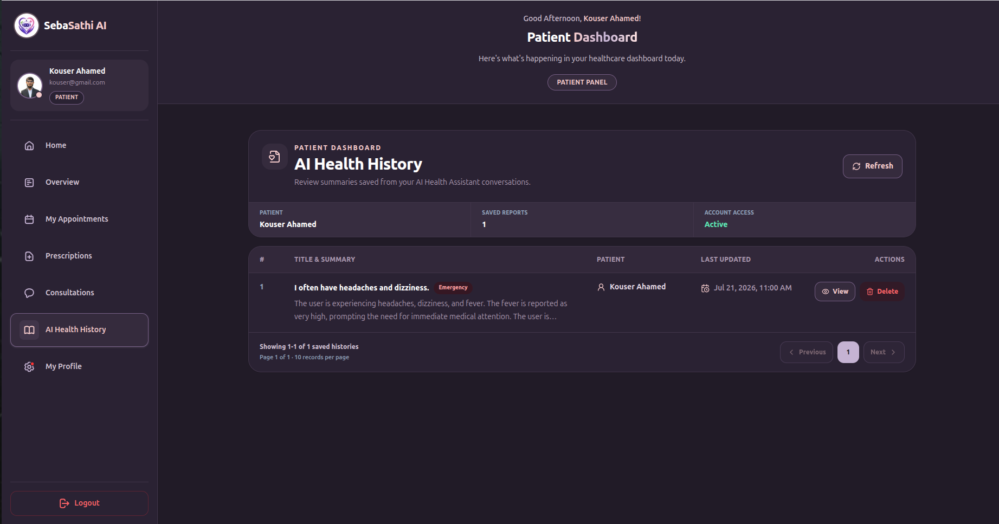
    </td>
    <td>
      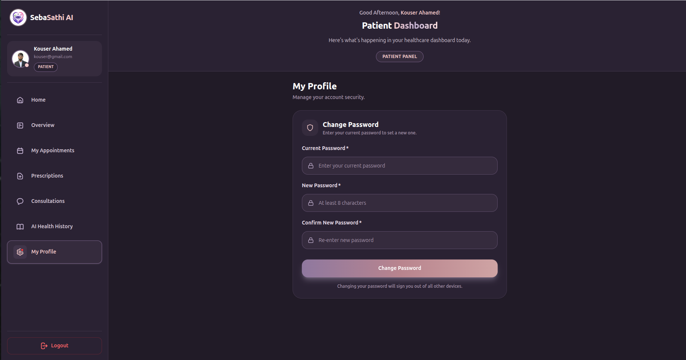
    </td>
  </tr>

  <tr>
    <td align="center"><strong>SebaSathi AI Screenshot 11</strong></td>
    <td align="center"><strong>SebaSathi AI Screenshot 12</strong></td>
  </tr>
  <tr>
    <td>
      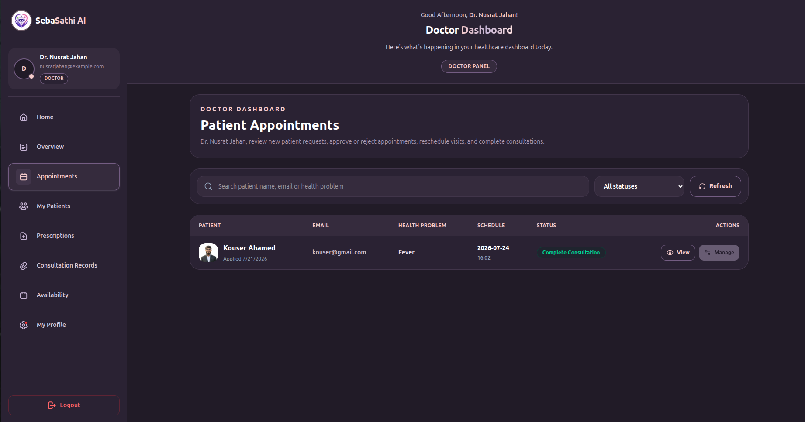
    </td>
    <td>
      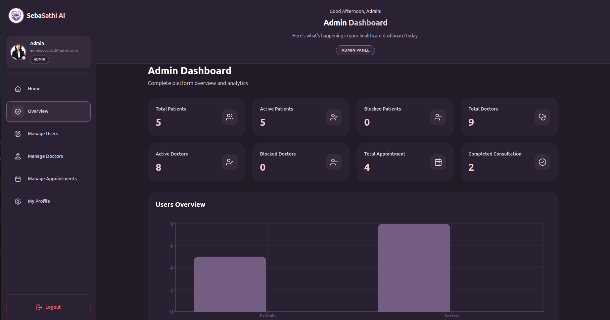
    </td>
  </tr>

  <tr>
    <td align="center"><strong>SebaSathi AI Screenshot 13</strong></td>
    <td align="center"><strong>SebaSathi AI Screenshot 14</strong></td>
  </tr>
  <tr>
    <td>
      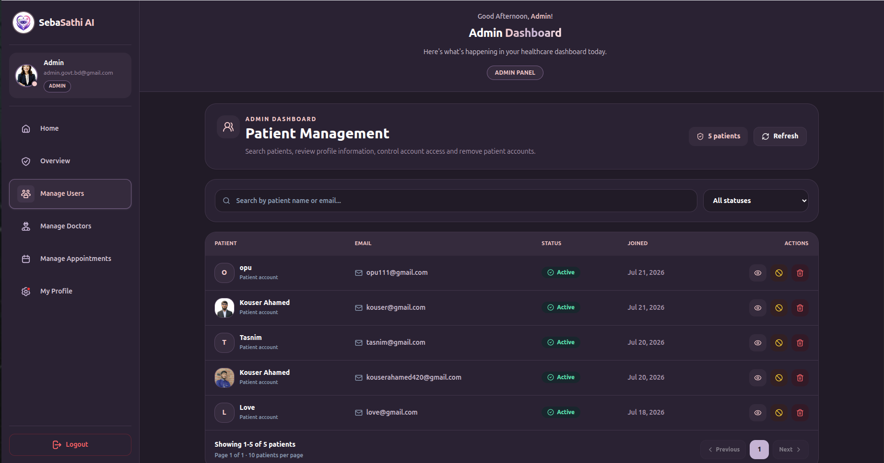
    </td>
    <td>
      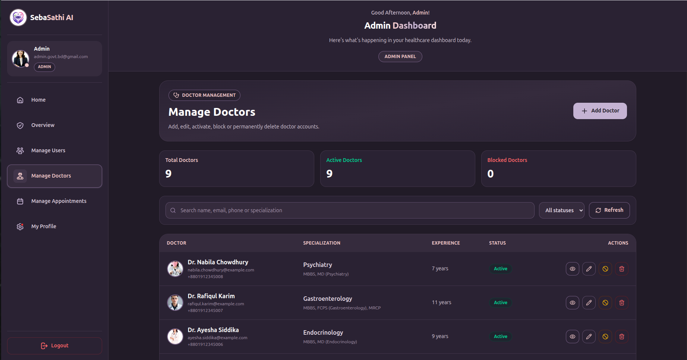
    </td>
  </tr>
</table>

---

## 🎯 Purpose of the Project

The main goals of SebaSathi AI are to:

- Make trusted doctor information easier to discover
- Help patients submit and track appointment requests
- Provide separate dashboards for administrators, doctors, and patients
- Offer safe, general AI-assisted health guidance
- Support health conversations in Bangla, Banglish, and English
- Preserve AI conversation history for an authenticated user
- Generate structured health summaries from symptom discussions
- Allow administrators to create and manage doctor accounts
- Improve access to digital healthcare support through a responsive interface
- Maintain secure frontend and backend communication using Better Auth and JWT verification

> The AI Health Assistant provides general guidance only. It does not replace a licensed physician, diagnosis, emergency service, or professional medical treatment.

---

## 🌐 Live Links

| Item | Link |
|------|------|
| 🌐 Live Website | https://sebasathiai-frontend.vercel.app |
| 📁 Frontend Repository | https://github.com/kouser-ahamed/sebasathiai-frontend |
| 🖥️ Backend Repository | https://github.com/kouser-ahamed/sebasathiai-backend |

---

## 🔐 Demo User Credentials

### Doctor Account

```text
Email    : nusratjahan@example.com
Password : Nusrat@12345
Role     : doctor
```

### Administrator Account

```text
Email    : admin.govt.bd@gmail.com
Password : Admin12345
Role     : admin
```

### Patient Account

```text
Email    : kouser@gmail.com
Password : kouser@gmail.com
Role     : patient
```

> These accounts are provided only for project demonstration. Keep only test data in public demo accounts. Do not reuse these passwords for personal or production accounts.

---

## ✨ Key Features

### 🌍 Public Features

- Modern and responsive healthcare landing page
- Public doctor directory
- Doctor search and browsing interface
- Doctor details page
- Doctor qualification, specialization, hospital, experience, contact, and address information
- Doctor rating and review display
- Custom doctor-unavailable message for invalid doctor IDs
- Responsive navigation for mobile, tablet, laptop, and desktop
- Dark and light mode support
- Accessible loading, empty, blocked, and error states
- Public AI Health Assistant page with protected chat access
- About and contact pages
- Production deployment on Vercel

### 🔑 Authentication Features

- Email and password registration
- Email and password login
- Google OAuth login
- Better Auth session management
- Persistent authentication after refresh
- Protected dashboard access
- Callback URL support after login
- Secure session cookies
- Better Auth JWKS endpoint
- JWT-based backend verification
- Logout support
- Role-aware navigation and dashboard access
- Account status support:
  - `active`
  - `blocked`

### 👥 Role-Based Access

The platform supports three roles:

```text
admin
doctor
patient
```

Backend-protected routes use the following middleware pattern:

```text
verifyToken
    ↓
verifyRole("admin" | "doctor" | "patient")
    ↓
verifyActive (when active status is required)
    ↓
Protected API operation
```

### 🧑‍⚕️ Doctor Discovery Features

- Browse public doctor profiles
- View doctor specialization
- View qualification and professional experience
- View hospital or workplace
- View phone, email, and address
- View doctor biography
- View average rating and review count
- Open a responsive doctor details page
- Display a custom unavailable state when no doctor matches the requested ID
- Keep the appointment button full width and positioned consistently in the details layout

### 📅 Appointment Features

- Patients can request appointments with available doctors
- Guests are redirected to login before booking
- Only patient accounts can submit appointment requests
- Administrators and doctors cannot request patient appointments
- Blocked users cannot request appointments
- Appointment eligibility is checked before navigation
- Patients can view appointment-related information from their dashboard
- Doctors can access appointment-management functionality
- Appointment status can be managed through protected backend routes

### ⭐ Review and Rating Features

- Display doctor reviews on public doctor profiles
- Show average rating
- Show total rating count
- Authenticated patients can interact with review functionality
- Reviews remain linked to the relevant doctor
- Doctor details update with current review information

### 🤖 AI Health Assistant

- Supports Bangla, Banglish, and English input
- Streams AI responses in real time
- Maintains conversation memory
- Stores conversations for the active account
- Allows users to create multiple health conversations
- Allows users to reopen previous conversations
- Allows users to delete saved conversations
- Provides symptom-discussion quick prompts
- Suggests suitable doctor categories
- Provides safe next-step guidance
- Shows emergency-care warnings
- Generates structured health summary reports
- Saves health summaries with linked conversation history
- Displays AI processing status and tool usage
- Uses Groq as the AI provider

### 🧾 AI Health History

- Saved AI conversations remain connected to the authenticated user
- Health-summary reports are linked to their source conversation
- Users can browse saved health-history entries
- Reports can include structured health information generated from the conversation
- Conversation and report metadata are stored in MongoDB

### 🛡️ Administrator Features

- Administrator dashboard
- User-management functionality
- Doctor account creation
- Doctor account creation through Better Auth email signup
- Role update from regular user to doctor
- Doctor profile insertion into the `doctors` collection
- Account status management
- Role-protected administrative APIs

### 🩺 Doctor Features

- Doctor-specific dashboard access
- Doctor profile data linked to an authenticated account
- Appointment-management functionality
- Role-protected backend access
- Account status validation before protected operations

### 👤 Patient Features

- Patient dashboard
- Doctor browsing
- Appointment requests
- Appointment eligibility checking
- Review and rating interaction
- AI Health Assistant access
- Persistent AI conversation history
- Structured health-summary generation
- Health-history browsing
- Profile and account-related functionality

### 📱 User Interface Features

- Responsive design for all common device sizes
- Tailwind CSS-based design system
- HeroUI components
- Framer Motion animations
- React Icons
- Toast notifications
- Custom loading states
- Custom empty and unavailable states
- Dark and light themes
- Consistent `max-w-7xl` layout alignment
- Mobile-friendly navigation and dashboard interfaces

---

## ⚙️ How SebaSathi AI Works

### Public User Flow

```text
Open SebaSathi AI
        ↓
Browse Available Doctors
        ↓
Open a Doctor Profile
        ↓
View Qualification, Experience, Hospital, Rating and Reviews
        ↓
Choose Appointment Now
        ↓
Login or Create an Account
        ↓
Continue as an Authenticated Patient
```

### Patient Flow

```text
Login as Patient
        ↓
Browse Doctors
        ↓
Open Doctor Details
        ↓
Check Appointment Eligibility
        ↓
Submit Appointment Request
        ↓
View Appointment Information
        ↓
Use AI Health Assistant
        ↓
Generate and Save Health Summary
```

### Doctor Flow

```text
Login as Doctor
        ↓
Open Doctor Dashboard
        ↓
View Doctor-Specific Information
        ↓
Review Appointment Activity
        ↓
Manage Allowed Doctor Operations
```

### Administrator Flow

```text
Login as Administrator
        ↓
Open Admin Dashboard
        ↓
Manage Users and Account Status
        ↓
Create Doctor Account
        ↓
Better Auth Creates Credential Account
        ↓
Backend Updates User Role to Doctor
        ↓
Doctor Profile Is Added to MongoDB
```

---

## 🔄 Role-Based Workflows

### Appointment Eligibility

```text
Appointment Now
      ↓
Is the user logged in?
      ├── No → Redirect to login with callback URL
      └── Yes
             ↓
      Is role patient?
      ├── No → Show patient-only message
      └── Yes
             ↓
      Is account blocked?
      ├── Yes → Show restricted message
      └── No
             ↓
      Check backend appointment eligibility
             ↓
      Allowed → Open appointment form
      Denied  → Show API message
```

### Doctor Account Creation

```text
Admin submits doctor information
        ↓
Backend validates administrator token and role
        ↓
Backend calls frontend Better Auth signup endpoint
        ↓
Better Auth creates account and credential records
        ↓
Backend updates the user role to doctor
        ↓
Backend inserts doctor profile into doctors collection
        ↓
Doctor can sign in using the created credentials
```

---

## 🤖 AI Health Assistant Workflow

```text
Authenticated user opens AI Health Assistant
        ↓
Access and account status are checked
        ↓
Saved conversations are loaded
        ↓
User selects an old chat or creates a new chat
        ↓
User describes symptoms
        ↓
Backend sends the conversation to Groq
        ↓
AI response streams to the interface
        ↓
Conversation is automatically saved
        ↓
User generates a structured summary
        ↓
Summary and conversation are linked in health history
```

### AI Safety Guidance

The assistant is designed to provide general information and safe next-step guidance. Emergency symptoms such as severe chest pain, breathing difficulty, unconsciousness, seizure, heavy bleeding, stroke signs, or self-harm risk require immediate professional or emergency care.

---

## 🔑 Authentication and Authorization

SebaSathi AI uses **Better Auth** on the frontend and **JWT verification with Better Auth JWKS** on the backend.

### Supported Login Methods

- Email and password
- Google OAuth

### Authentication API

```text
GET/POST /api/auth/[...all]
```

### JWKS Verification Flow

```text
User Authenticates with Better Auth
        ↓
Frontend Creates a Session
        ↓
Protected frontend operation requests a token
        ↓
Token is sent to the Express backend
        ↓
Backend fetches Better Auth JWKS
        ↓
JOSE verifies token signature and claims
        ↓
Backend checks role and account status
        ↓
Protected operation is allowed
```

### Protected Request Example

```http
Authorization: Bearer <jwt_token>
```

### Authorization Rules

- `admin` routes require an administrator role
- `doctor` routes require a doctor role
- `patient` routes require a patient role
- Some routes additionally require `status: active`
- Blocked accounts cannot access protected active-only operations
- Backend authorization is not dependent only on frontend checks

---

## 🛠️ Technology Stack

### Frontend

| Technology | Purpose |
|------------|---------|
| Next.js 16.2.10 | App Router, routing, rendering, server components, and production build |
| React | Component-based user interface |
| TypeScript | Static typing and development safety |
| Tailwind CSS 4 | Responsive utility-first styling |
| HeroUI | Reusable and accessible UI components |
| Better Auth | Email/password auth, Google OAuth, sessions, and JWKS |
| Framer Motion | UI animation |
| React Icons | Interface icons |
| React Toastify | Success and error notifications |
| Next Image | Optimized image rendering |
| Vercel | Frontend deployment |

### Backend

| Technology | Purpose |
|------------|---------|
| Node.js | Backend runtime |
| Express 5 | REST API framework |
| TypeScript | Typed backend development |
| MongoDB Driver | Direct MongoDB access |
| MongoDB Atlas | Cloud-hosted database |
| jose-cjs | JWT and JWKS verification |
| CORS | Cross-origin request control |
| dotenv | Environment variable loading |
| Groq API | AI health assistant response generation |

---

## 🧰 Package Commands

The system contains two independent packages. There is no shared code and no workspace tool.

### Frontend Commands

Run inside `sebasathiai-frontend/`:

| Command | Purpose |
|---------|---------|
| `npm run dev` | Start Next.js development server |
| `npm run build` | Create production build and check TypeScript |
| `npm run lint` | Run Next.js/ESLint linting |

> No separate frontend type-check command is configured. `npm run build` performs the required type validation.

### Backend Commands

Run inside `sebasathiai-backend/`:

| Command | Purpose |
|---------|---------|
| `npm run dev` | Start backend with `tsx watch index.ts` |
| `npm run build` | Compile TypeScript into `dist/` |
| `npm run type-check` | Run `tsc --noEmit` |
| `npm start` | Run `node dist/index.js` |

> No automated tests are currently configured in either package.

---

## 📦 NPM Packages

### Frontend Core Packages

```text
next
react
react-dom
typescript
tailwindcss
@heroui/react
better-auth
framer-motion
react-icons
react-toastify
```

### Backend Runtime Packages

```text
express
mongodb
cors
dotenv
jose-cjs
```

### Backend Development Packages

```text
typescript
tsx
@types/node
@types/express
@types/cors
```

---

## 🗄️ Database Collections

SebaSathi AI uses MongoDB. Important collections include:

| Collection | Purpose |
|------------|---------|
| `user` | Better Auth users, roles, and status |
| `session` | Better Auth sessions |
| `account` | Authentication provider and credential records |
| `verification` | Better Auth verification data |
| `doctors` | Public and dashboard doctor profile information |
| `AI-health-History` | Structured AI-generated health summaries |
| `all-history` | Persistent AI health conversations and related history |

Additional collections may be used for appointments, reviews, and other application features depending on the active backend implementation.

---

## 🔒 Environment Variables

Each package requires its own environment file.

### Frontend Environment

Create `sebasathiai-frontend/.env.local`:

```env
MONGODB_URI=your_mongodb_connection_string
MONGODB_DB_NAME=your_database_name

BETTER_AUTH_SECRET=your_long_random_better_auth_secret
BETTER_AUTH_URL=http://localhost:3000

GOOGLE_CLIENT_ID=your_google_oauth_client_id
GOOGLE_CLIENT_SECRET=your_google_oauth_client_secret

NEXT_PUBLIC_API_URL=http://localhost:5000
```

Production example:

```env
BETTER_AUTH_URL=https://sebasathiai-frontend.vercel.app
NEXT_PUBLIC_API_URL=https://your-backend-domain.example.com
```

### Backend Environment

Create `sebasathiai-backend/.env`:

```env
PORT=5000

MONGODB_URI=your_mongodb_connection_string
MONGODB_DB_NAME=your_database_name

CLIENT_URL=http://localhost:3000
BETTER_AUTH_URL=http://localhost:3000

GROQ_API_KEY=your_groq_api_key
GROQ_API_BASE_URL=https://api.groq.com/openai/v1
GROQ_MODEL=your_supported_groq_model
```

Production example:

```env
CLIENT_URL=https://sebasathiai-frontend.vercel.app
BETTER_AUTH_URL=https://sebasathiai-frontend.vercel.app
```

> Never place real database credentials, OAuth secrets, Better Auth secrets, API keys, or production passwords inside this README.

---

## 💻 Installation and Setup

### Prerequisites

- Node.js compatible with Next.js 16
- npm
- Git
- MongoDB Atlas account or local MongoDB
- Google Cloud OAuth credentials
- Groq API key

### Option A: Clone the Repositories Separately

#### 1. Clone the Frontend

```bash
git clone https://github.com/kouser-ahamed/sebasathiai-frontend.git
cd sebasathiai-frontend
```

#### 2. Install Frontend Dependencies

```bash
npm install
```

#### 3. Configure Frontend Environment

Create `.env.local` and add the required frontend variables.

#### 4. Start the Frontend

```bash
npm run dev
```

Frontend development URL:

```text
http://localhost:3000
```

#### 5. Clone the Backend

Open another terminal:

```bash
git clone https://github.com/kouser-ahamed/sebasathiai-backend.git
cd sebasathiai-backend
```

#### 6. Install Backend Dependencies

```bash
npm install
```

#### 7. Configure Backend Environment

Create `.env` and add the required backend variables.

#### 8. Start the Backend

```bash
npm run dev
```

Backend development URL:

```text
http://localhost:5000
```

### Option B: Keep Both Packages Side by Side

```text
SCIC-SebaSathi-AI/
├── sebasathiai-frontend/
└── sebasathiai-backend/
```

Install and run each package independently:

```bash
cd sebasathiai-frontend
npm install
npm run dev
```

In a second terminal:

```bash
cd sebasathiai-backend
npm install
npm run dev
```

### Production Build

Frontend:

```bash
cd sebasathiai-frontend
npm run build
npm start
```

Backend:

```bash
cd sebasathiai-backend
npm run build
npm start
```

---

## 🗺️ Project Routes

The following list represents the main route groups used by the application.

### Public Routes

```text
/
/find-doctors
/find-doctors/[id]
/ai-health-assistant
/about
/contact
```

### Authentication Routes

```text
/auth/signin
/api/auth/[...all]
/api/auth/jwks
```

> Some existing code references `/auth/login`, while the dashboard redirect uses `/auth/signin`. Standardize the login route name across the project to avoid broken callback URLs.

### Dashboard Routes

```text
/dashboard
/dashboard/admin/*
/dashboard/doctor/*
/dashboard/patient/*
/dashboard/patient/ai-health-history
```

### Dynamic Doctor Route

```text
/find-doctors/[id]
```

When the requested doctor ID does not match an available doctor, the page displays a custom doctor-unavailable message instead of rendering invalid details.

---

## 🔌 API Overview

The backend is currently implemented in a single large `index.ts` file with inline route handlers.

### Authentication

- Better Auth registration and login
- Google OAuth
- Session management
- JWKS publication
- JWT verification on the backend
- Role and status authorization

### Doctors

- Create a doctor account as an administrator
- Store doctor profile information
- Get public doctor listings
- Get one doctor by ID
- Return doctor details and rating information
- Manage doctor-related account data

### Appointments

- Check patient appointment eligibility
- Submit appointment requests
- Retrieve appointment information
- Restrict appointment submission to patients
- Prevent blocked users from booking
- Support doctor and administrator appointment-management operations
- Update appointment status through protected routes

### Reviews

- Retrieve public doctor reviews
- Calculate doctor rating information
- Save eligible patient reviews
- Link reviews to the relevant doctor

### AI Health Assistant

- Check AI assistant access
- Create a health conversation
- Get all saved conversations
- Get one saved conversation
- Delete a conversation
- Stream an AI response
- Preserve conversation memory
- Generate a structured health summary
- Save report and conversation history

### Administration

- Verify administrator role
- Create doctor accounts through Better Auth
- Update user role
- Insert doctor profile
- Manage user status
- Access protected administrative data

---

## 📁 Project Structure

### Combined Project Layout

```text
SCIC-SebaSathi-AI/
├── sebasathiai-frontend/
│   ├── public/
│   │   └── assets/
│   │       └── SebaSathiAI/
│   │           └── UI/
│   │               ├── 1.png
│   │               └── 14.png
│   ├── src/
│   │   ├── app/
│   │   │   ├── api/
│   │   │   │   └── auth/
│   │   │   │       └── [...all]/
│   │   │   ├── ai-health-assistant/
│   │   │   ├── auth/
│   │   │   ├── dashboard/
│   │   │   │   ├── admin/
│   │   │   │   ├── doctor/
│   │   │   │   └── patient/
│   │   │   ├── find-doctors/
│   │   │   │   └── [id]/
│   │   │   └── page.tsx
│   │   ├── components/
│   │   │   ├── AllDoctors/
│   │   │   └── ...
│   │   ├── lib/
│   │   │   ├── auth.ts
│   │   │   ├── auth-client.ts
│   │   │   ├── auth-redirect.ts
│   │   │   └── core/
│   │   │       └── session.ts
│   │   └── proxy.ts
│   ├── .env.local
│   ├── package.json
│   └── README.md
│
└── sebasathiai-backend/
    ├── index.ts
    ├── dist/
    ├── .env
    ├── package.json
    └── tsconfig.json
```

---

## 🏗️ Architecture Notes

### Independent Packages

- Frontend and backend are independent packages
- There is no shared source-code package
- There is no npm workspace, Turborepo, or other workspace tool
- Each package has its own dependencies, scripts, environment variables, and deployment configuration

### Backend Structure

- The backend is currently a single large `index.ts`
- Route handlers are written inline
- There is no controller/router/service split
- A future refactor could separate:
  - middleware
  - routes
  - controllers
  - services
  - database helpers
  - validation schemas
  - AI services

### Better Auth Doctor Creation

Administrator-created doctor accounts follow this pattern:

```text
Admin request
    ↓
Express backend
    ↓
Frontend Better Auth email signup endpoint
    ↓
Better Auth creates user/account data
    ↓
Backend updates role
    ↓
Backend inserts doctor profile
```

### Session File

`src/lib/core/session.ts` contains a commented-out older implementation above the active implementation. Only the active second version is used.

### Stale Routes

The following files contain route prefixes left from an older food-sharing project:

```text
src/lib/auth-redirect.ts
src/proxy.ts
```

Examples include:

```text
/share-food
/my-shared-foods
```

Do not treat those stale prefixes as authoritative SebaSathi AI routes. Remove or replace them with current healthcare routes.

### Auth Route Consistency

Some parts of the code use:

```text
/auth/signin
```

Other parts may use:

```text
/auth/login
```

Use one consistent route and update all callback URLs, redirects, middleware rules, and protected-page logic.

---

## 🚨 Security Notice

The project information indicates that `.env` files are currently committed and secrets have been exposed.

Before using the project in production:

1. Remove `.env` and `.env.local` files from Git tracking.
2. Add all environment files to `.gitignore`.
3. Rotate the MongoDB username and password.
4. Rotate `BETTER_AUTH_SECRET`.
5. Regenerate Google OAuth credentials when necessary.
6. Rotate the Groq API key.
7. Review Vercel environment variables.
8. Remove sensitive values from Git history.
9. Confirm that no secret is present in source files, README files, build logs, or screenshots.
10. Never treat deleting the current `.env` file as enough if it was already pushed to GitHub.

Recommended `.gitignore` entries:

```gitignore
.env
.env.*
!.env.example
```

Create safe example files instead:

```text
.env.example
.env.local.example
```

These example files should contain variable names and placeholders only.

---

## 👨‍💻 Developer

**Kouser Ahamed**

SebaSathi AI demonstrates experience with:

- Next.js App Router
- React and TypeScript
- Tailwind CSS and HeroUI
- Responsive healthcare interface design
- Better Auth
- Email/password authentication
- Google OAuth
- Role-based dashboards
- Express.js REST APIs
- MongoDB integration
- JWT and JWKS verification
- AI response streaming
- Groq API integration
- Persistent AI conversations
- Structured health-history generation
- Production deployment with Vercel

### GitHub

https://github.com/kouser-ahamed

---

## 📝 Project Information

```text
Project Name       : SebaSathi AI
Project Category   : AI-Powered Healthcare Platform
Frontend           : Next.js 16.2.10, React, TypeScript, Tailwind CSS 4, HeroUI
Backend            : Node.js, Express 5, TypeScript
Database           : MongoDB
Authentication     : Better Auth, Google OAuth
Authorization      : JWT verification through Better Auth JWKS
AI Provider        : Groq
Supported Roles    : admin, doctor, patient
Account Status     : active, blocked
Live Website       : https://sebasathiai-frontend.vercel.app
Frontend Repo      : https://github.com/kouser-ahamed/sebasathiai-frontend
Backend Repo       : https://github.com/kouser-ahamed/sebasathiai-backend
```

---

<div align="center">

### Smart Healthcare Guidance, Doctor Access, and Patient Support in One Platform

© 2026 SebaSathi AI. All rights reserved.

</div>